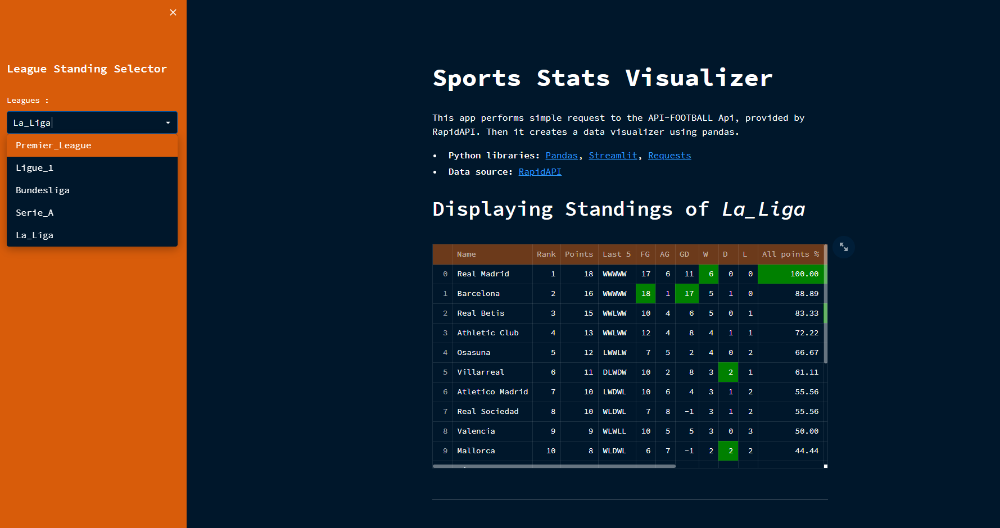

# Sport_EventsStats_Collector

Script which makes a Streamlit app showing data from the main european football leagues.  [Go to the app](https://brr1-99-sport-events-stats-collector-app-3bmktc.streamlitapp.com/)

    

 
<h2 align="center"> Tables </h2>

All tables are interactive and dynamic. You can use the selectors on the left side of the streamlit app to obtain your desired data.

## Standings Table

## Round odds Table

